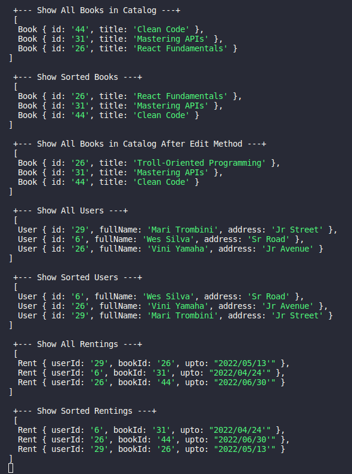

<h1 align="center"> Library Project </h1>

### Library system using Facade pattern

 

#### Exercise for didactic purposes

 

### `Functionalities`

- Add Book to Catalog
- Edit Book
- Show All Books in Catalog
- Signup User
- Show All Users
- Rent
- Show All Rentings

### `Instructions`

- Clone the repository
- Run the commands `npm install` and `npm start`

 

## Code Example

